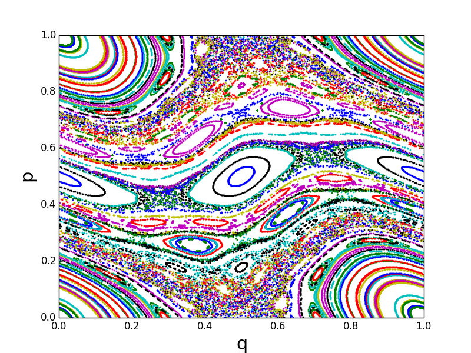
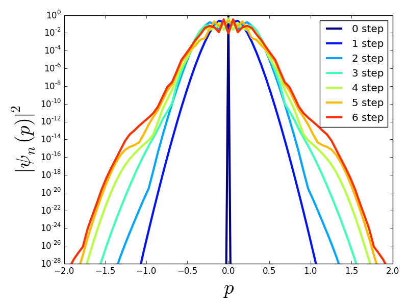
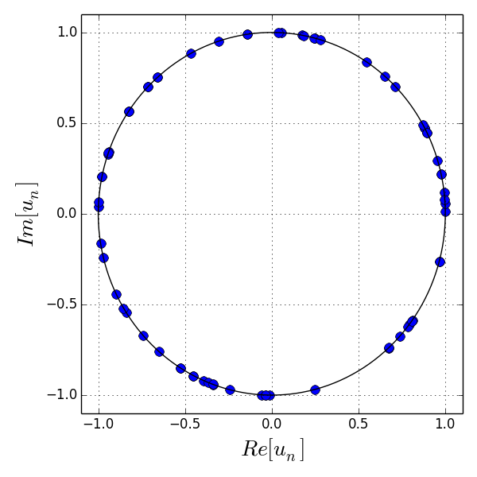
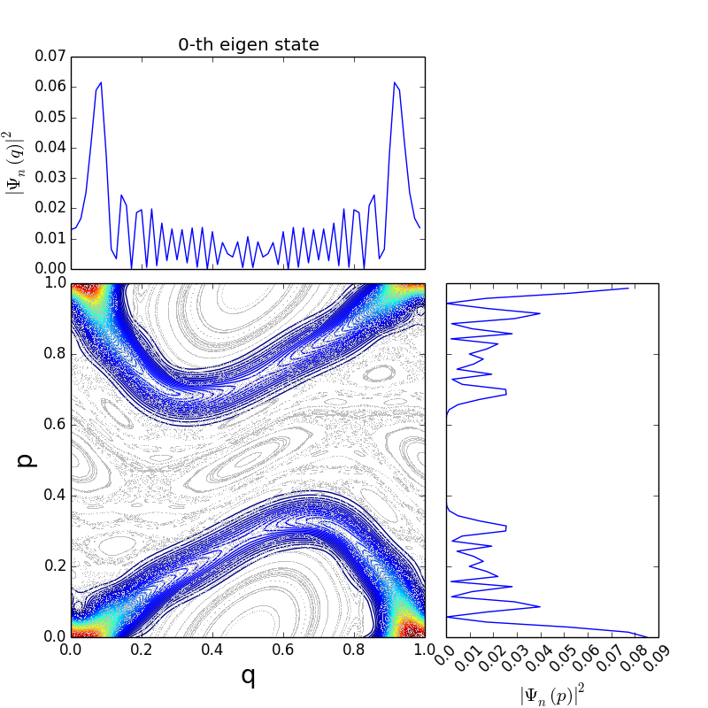
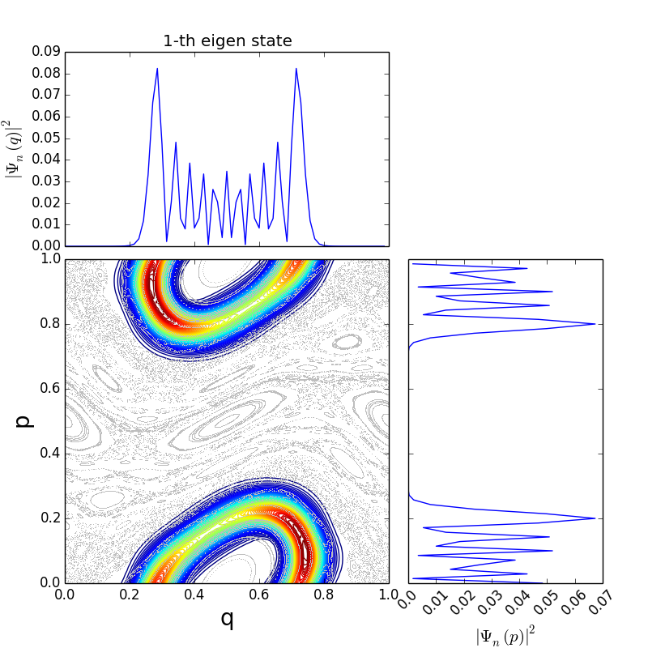

==========
Tutorial
==========

本チュートリアルでは

    1. numpy
    2. matplotlib
    3. SimpleQmap

のパッケージを用います．
sampleなので，参考程度と思ってください．

Classical dynamics
----------

標準写像を用いた時間発展は

.. literalinclude:: ./samples/cmap.py

で行っている．位相空間中の軌道群をplotすると，このような結果が得られるはずである．

Quantum dynamics: initial value problem
----------

与えられた状態の時間発展を解く．
いま初期条件として

.. math:: 

	\langle p | \psi_0 \rangle = \delta(p)

を与える．SimpleQmapにおける時間発展は

.. math::

	\hat{U} = \exp[-\frac{i}{\hbar}T(\hat{p})] \exp[-\frac{i}{\hbar}V(\hat{q})]
	
の演算順序で行われているので，初期条件をsetする際にFouier 逆変換を用いて

.. math::
	
	\langle q | \psi_0 \rangle = \sum_q \langle p | q \rangle \! \langle q | \psi_0 \rangle
	
:math:`q` -表示に変換している．Sample コードは以下の通りである．

.. literalinclude:: ./samples/evolv.py

計算結果は

となる．より詳しい解説は http://japanichaos.appspot.com/Quantum.html#id1 を参考にしてほしい．
(x軸のscaleは :math:`2\pi` 倍すれば同一の結果である)

Quantum dynamics: eigen value problem
----------

　次に時間発展演算子 :math:`\hat{U}` の固有値問題，

.. math::

	\hat{U} | \Psi_n\rangle = u_n | \Psi_n\rangle

を解く．
ここで， :math:`|\Psi_n\rangle` は(擬)固有状態，であり，
:math:`u_n` は固有値である．
Floquet の定理より

.. math::

	u_n = e^{-i\epsilon_n}

として与えられ，
:math:`\epsilon_n \in \mathbb{R}` は(擬)固有位相と呼ばれる．

　Sampleコードは以下の通りである．

.. literalinclude:: ./samples/eigen.py

   
Quantum dynamics: phase space representation
----------

　前節で固有値について説明したので，次に固有関数について調べる．
固有関数 :math:`|\Psi_n \rangle` はq-表示やp-表示を用いることが慣例的であるが，
古典力学(位相空間)との対応を考える上で伏見表示(擬位相空間分布)も重要になる．
詳細な伏見表示定義はここでは説明しない．言葉で説明すると
位相空間上を適当にgridを切り格子点にCoherent stateとの内積の絶対値2乗を取ることで位相空間における
確率密度を測る方法である．

　Sample コードは次の通りであるが，:doc:`require` の最後の bash make.sh を実行する必要がある．

.. literalinclude:: ./samples/eigen_rep.py

典型的な計算結果は

   

	
	
+---------+---------+
| |hsm1|  | |hsm2|  |
+---------+---------+

となる．

